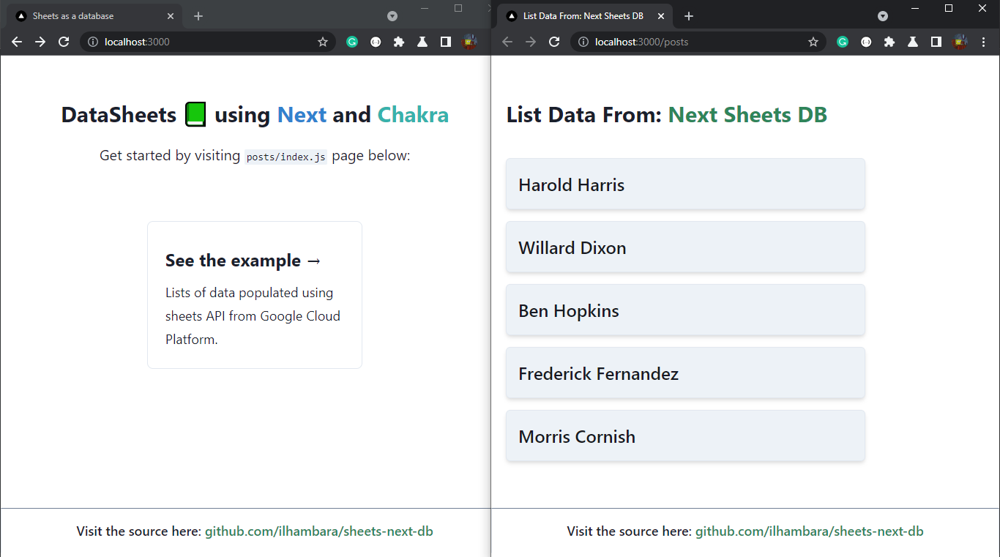
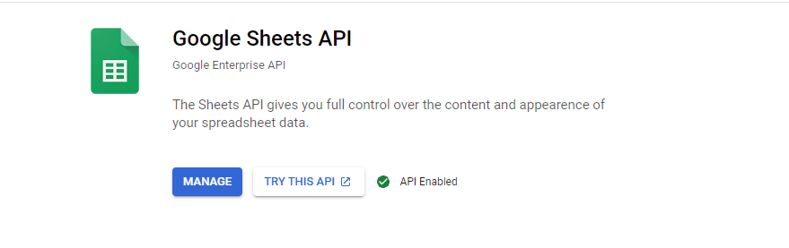
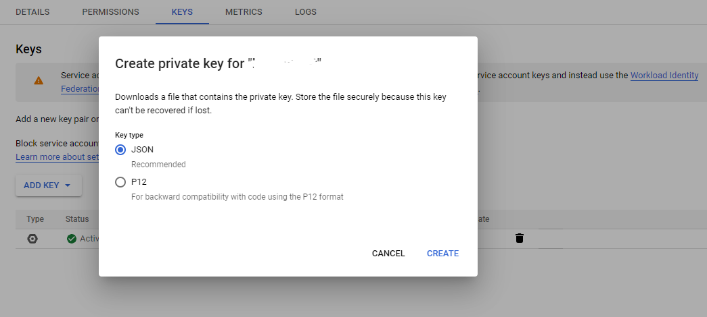
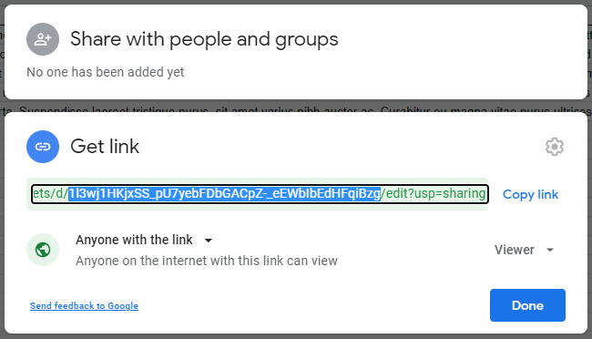

# Google Sheets as a Database



This project is a quick _proof-of-concept_ in turned google spreadsheets as a database using provided API from its official source Google Cloud Platform (GCP). The image shown is a preview of the project in development server.

And this is a [Next.js](https://nextjs.org/) project bootstrapped with [`create-next-app`](https://github.com/vercel/next.js/tree/canary/packages/create-next-app) combined with [Chakra UI](https://chakra-ui.com/).

## Getting Started

To run this project locally on your machine, follow this steps:

**1. Clone this repository**

```
git clone https://github.com/ilhambara/sheets-next-db.git
```

**2. Get your private key to connect to your sheets**

- First you need to `create a service account`. See [how to create it](https://cloud.google.com/iam/docs/creating-managing-service-accounts) from the official docs.

- Enable google sheets API. Visit this to [enable an API](https://support.google.com/googleapi/answer/6158841?hl=en).



- Get your credentials and save it as a JSON. Go to APIs & Services > Select your Service Account > Add a key in JSON type. Save it and add to your project.



**3. Create your `.env.local` files**

- Copy all text inside the `.env.local.example` to your `.env.local` file.

- Fill the `GOOGLE_APPLICATION_CREDENTIALS` with a path to your private key from step 3.

- And you can get the `SHEET_ID` your spreadsheets like this:



Note: notice that the highlighted string is a `SHEET_ID` that we use in our `.env.local` file.

**4. Install required dependencies**

```
npm install
```

**5. Run the development server**

At last, run the development server to see the result.

```
npm run dev
```

Open [http://localhost:3000](http://localhost:3000) with your browser to see the result.

You can start editing the page by modifying `pages/index.js`. The page auto-updates as you edit the file.

## Tech Stacks

- Next.js
- Chakra UI
- GoogleSheets API
- googleapis (NPM package)

## Learn More

Also you can take a look at these useful resources:

- [Next.js Docs](https://nextjs.org/docs) - learn about Next.js features and API.
- [Chakra UI Docs](https://chakra-ui.com/docs/getting-started) - explore Chakra UI.
- [Sheets for Developers](https://developers.google.com/sheets/api) - get started, docs, and all about Sheets API.
